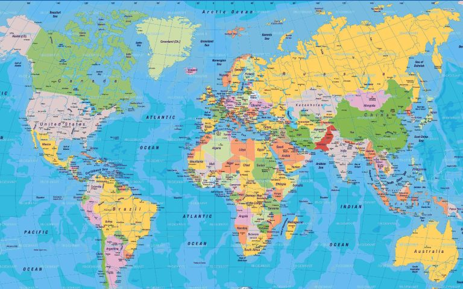
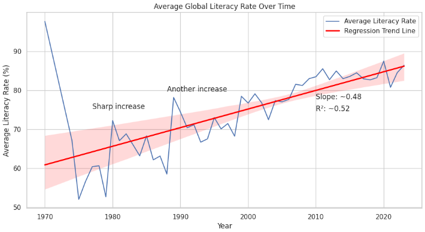
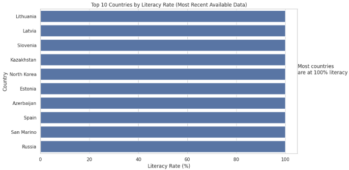
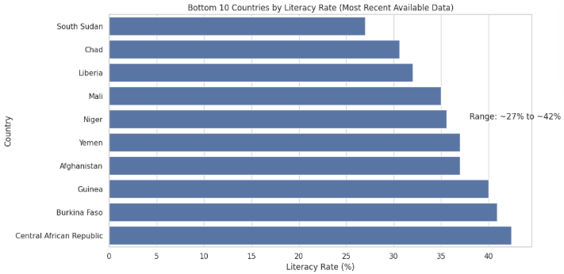
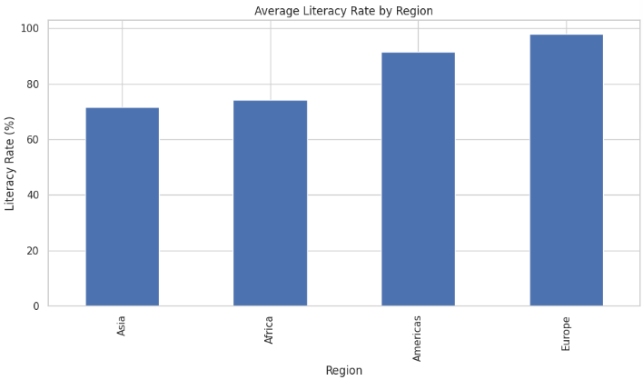
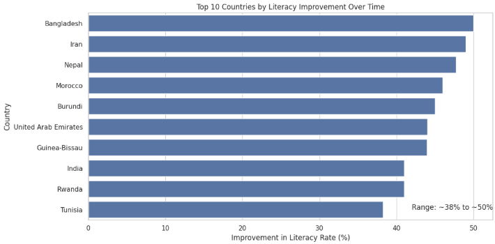

# Global Literacy Rates Analysis

## Project Overview

This project analyzes global literacy rates using data from Our World in Data. The goal was to explore how literacy rates differ across countries, regions, and over time.

Using Python, pandas, matplotlib, seaborn, and SciPy, I investigated long-term literacy trends and created visualizations to better understand global education patterns.

---

## Research Questions

1. How have global literacy rates changed over time?
2. Which countries have the highest and lowest literacy rates?
3. How do literacy rates differ across regions?
4. Which countries experienced the largest literacy improvements over time?

---

## Disclaimer

Since there isn't a single year with complete global coverage, different countries report literacy data in different years. Earlier decades contain fewer observations, while more recent years include much broader coverage.

To avoid excluding a large number of countries, this analysis uses the most recent available literacy rate for each country. This allows for a more complete global comparison, even though reporting years vary slightly across countries.

---

## Global Literacy Rates Over Time (1970-2023)

The positive slope (0.48) shows that global literacy rates have generally increase over time. On average, literacy has risen by about 0.48 percentage points per year.

The R² value of 0.52 suggests that time explains about half of the variation in literacy rates. This means that there is a clear upward trend overall, but it's not perfectly consistent. Other factors that may influence these results are differences between countries, gaps in data reporting, and regional inequality.

Overall, the regression supports what the graph shows. Global literacy has improved over time, but progress is uneven.

---

## Top 10 Countries With the Highest Literacy Rate

These countries have extremely high literacy rates, many at or close to 100%. This reflects strong education systems and broad access to basic schooling.

It’s important to note that these values come from each country’s most recent available data, so the exact reporting years may differ slightly between countries.

---

## Top 10 Countries With the Lowest Literacy Rate

These countries show much lower literacy rates, ranging from roughly 27% to just above 40%. This points to ongoing challenges such as limited access to education, economic barriers, and long-term development constraints.

Together, these results highlight major global inequalities in access to education and literacy outcomes.

---

## Literacy Rates by Region

The chart above shows clear differences in average literacy rates across regions.

Europe has the highest average literacy rate at about 98%, while the Americas also show relatively high levels at around 92%.

Asia and Africa have lower averages, at roughly 72% and 74% respectively. While these two regions are fairly close to each other, both remain significantly below Europe and the Americas.

Overall, the pattern highlights global inequality in education outcomes, likely shaped by differences in economic development, access to schooling, and long-term investment in education systems.

---

## Countries With Largest Literacy Improvements

This chart shows the countries with the largest improvements in literacy rates over time.

Countries such as Bangladesh, Iran, Nepal, and Morocco showed some of the most improvements with roughly 45–50%. Several other countries, including India, Rwanda, and Burundi, also showed substantial progress.

Overall, this suggests major improvements in literacy across many developing countries, likely driven by expanded access to education and long-term development efforts.

However, the size of improvement varies between countries, showing that progress in education has not been uniform across the world.

It’s also important to note that these changes are calculated using each country’s earliest and latest available data, so the time spans differ between countries.

---

## Key Findings

- Global literacy rates generally increased from 1970–2023.
- European countries had the highest average literacy rates.
- Several countries in Africa and Asia still face lower literacy levels.
- Bangladesh, Iran, and Nepal showed some of the largest literacy improvements over time.

---

## New Technique Used

For this project, I researched and applied linear regression using the SciPy library.

I used regression analysis to measure the overall trend in global literacy rates over time and calculate the average yearly increase in literacy rates.

This helped quantify the trend rather than only visually interpreting it from the graph.

---

## Data Source

- Our World in Data Literacy Dataset
- https://ourworldindata.org/literacy

---

## Project Files

- [View Colab Notebook](./Final%20Project/YOUR_NOTEBOOK_NAME.ipynb)
- [View Dataset](./Final%20Project/global_literacy_rates.csv)

---

## Reflection

One challenge in this project was dealing with missing and inconsistent yearly data across countries. Different countries reported literacy data in different years, which made direct comparisons more difficult.

If I had more time, I would expand this project by incorporating additional datasets such as GDP, education spending, or school enrollment to better understand what factors most influence literacy rates.